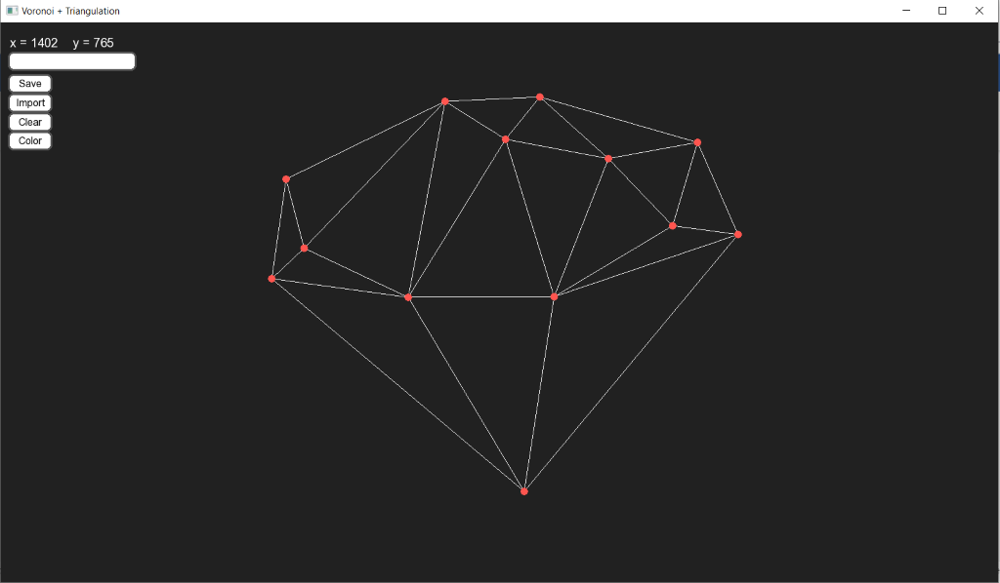

# Delaunay-Voronoi

Application that computes the Delaunay triangulation for a set of points in 2D by precompunting the Voronoi Diagram.

Functionality:
-	Add point (left click)
-	Add point by coordinate
-	Delete point (right click)
-	Show/hide Voronoi diagram (press V)
-	Show/hide triangulation edges (press T)
-	Import points
-	Clear window
-	Inverse color (Light mode/Dark mode)

Programming language: C++
GUI library: SFML

By:
Mazur Daniela,
Trubca Dmitri,
Ursu Nicolae,
Danilescu Alexandru
